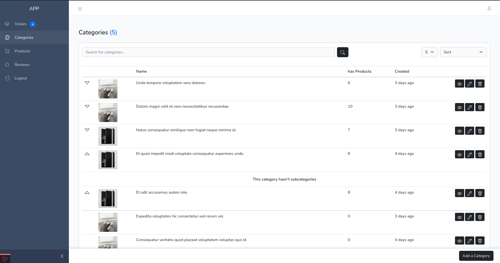
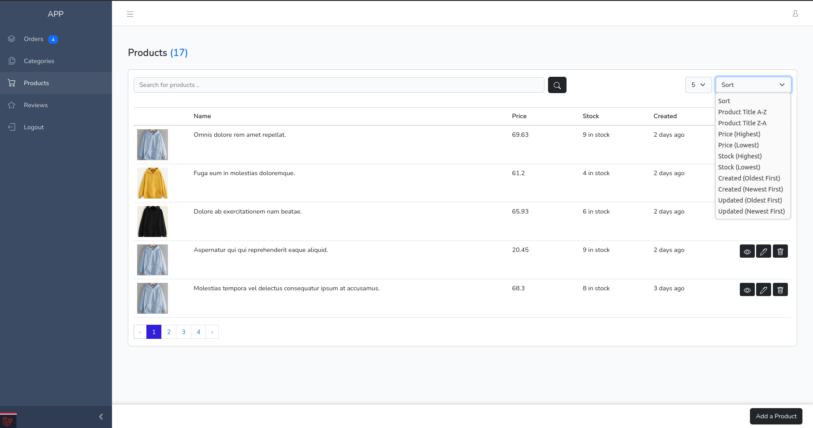
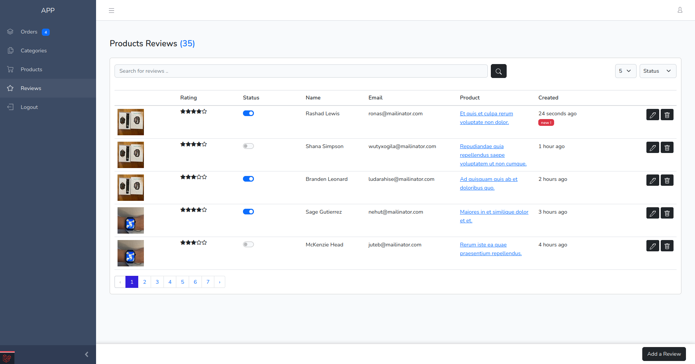
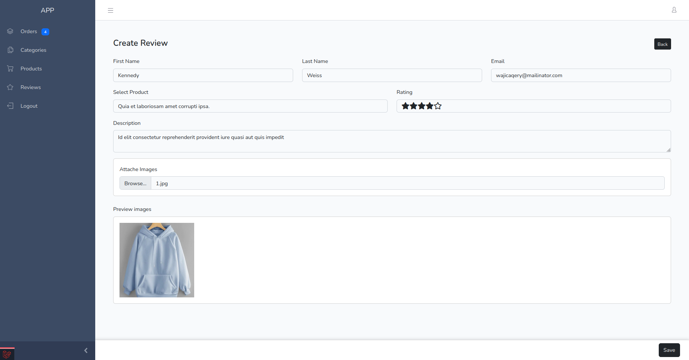

# ecom-so

## Project overview:






## Starting Project

1. install laravel packs

```composer
composer install
```

1. Run the following command to generate your app key:

```
php artisan key:generate
```

Create the symbolic link:

```
php artisan storage:link
```

2. install npm and run

```npm
npm install
```

```npm
npm run dev
```

## Generate Data

```
php artisan migrate:fresh --seed
```

## validate PHP-PSR2

```
./vendor/bin/phpcs app/Http/Controllers/Product/ProductController.php --standard=PSR2
```
```

## Attach product to category

$product->categories()->attach($category1);
$product->categories()->detach($category1);


## Contributors

* **Soulaimane Yahya** (https://github.com/soulaimaneyahya)
* **souf1neCoder** (https://github.com/souf1neCoder/ecom-so)
